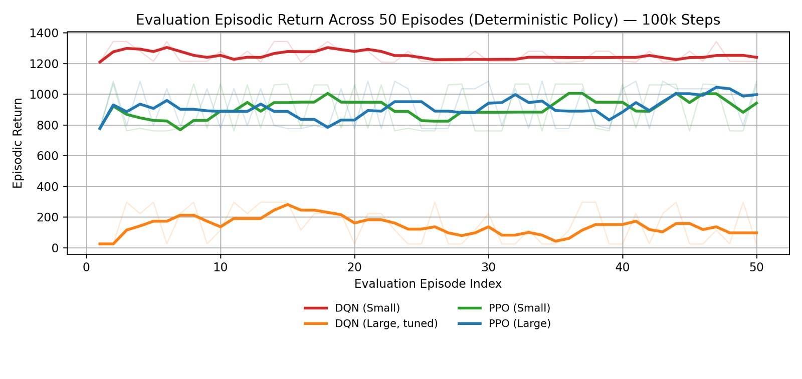
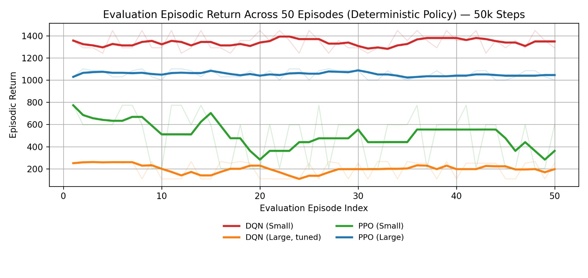
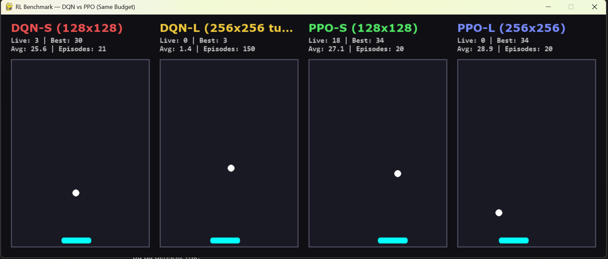

# Off-Policy and On-Policy Deep Reinforcement Learning in a Pygame-Based Squash Environment
**Fixed-budget comparison of DQN (off-policy) and PPO (on-policy) using Stable-Baselines3.**

📄 **Paper (PDF):** [View the full paper](paper.pdf)

---

## Overview
This repository provides:
- A custom **Pygame-based squash/paddle-ball** environment exposed via a **Gymnasium-compatible** interface.
- A **fixed-budget** training protocol to compare **DQN** and **PPO** under identical interaction budgets.
- Reproducible evaluation and CSV logging for analysis.

---

## Environment
**Observation (state):** 5D continuous vector  
- normalized paddle horizontal position  
- normalized ball position (x, y)  
- scaled ball velocity (dx, dy)

**Action space:** Discrete (3)  
- 0: stay  
- 1: move left  
- 2: move right  

**Reward:** dense shaping + sparse event reward  
- shaping encourages alignment between paddle center and ball x  
- +15 on successful paddle return  
- -15 on miss (termination)

**Primary task metric:** `score` (number of successful returns)

---

## Methods
We benchmark:
- **DQN**: off-policy value-based learning
- **PPO**: on-policy policy-gradient learning

All models are trained with the same interaction budget (**fixed environment steps**) to ensure a fair comparison.

---

## Experimental Results

### Evaluation Performance (Deterministic Policy)
The following plots report episodic returns over **50 evaluation episodes** using **deterministic** policies.

**100k Training Steps**
<p align="center">
  
</p>

**50k Training Steps**
<p align="center">
  
</p>

---

### Live Multi-Agent Dashboard
<p align="center">
  
</p>

The dashboard provides real-time visualization of trained agents operating in parallel, including live score, best score, and episode statistics for each model configuration.

---

## Project Structure
- `main.py` — environment, training, evaluation, and dashboard
- `paper.pdf` — project report / paper
- `assets/` — figures used in README
- `training_episodes.csv` — training episode logs (generated after training)
- `hyperparams.csv` — hyperparameters used for each model (generated)
- `eval_episodes.csv` — per-episode evaluation results (generated)
- `eval_summary.csv` — aggregated evaluation metrics (generated)
- `dashboard_scores.csv` — scores collected during dashboard run (generated, optional)

---

## Installation
```bash
pip install gymnasium pygame stable-baselines3 torch numpy pandas
